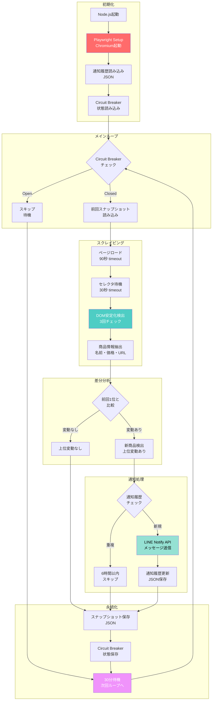

# 🐳 2ndstreet Monitor

[](https://github.com/rancorder/2ndstreet-monitor)
[](https://nodejs.org/)
[](https://www.docker.com/)
[](LICENSE)

> **JavaScript + Docker実装による実案件スクレイピング自動化**  
> セカンドストリート商品監視を完全自動化し、24/7稼働で取りこぼしゼロを実現

---

## 🎯 Overview

2ndstreet Monitorは、セカンドストリートの商品ページを定期監視し、新規掲載商品をLINEで即座に通知する自動化システムです。

### ビジネス価値
- ⏰ **工数90%削減**: 手動監視(1日3回×10分) → 完全自動化(24/7稼働)
- 🎯 **取りこぼしゼロ**: 30分間隔の自動実行で機会損失を防止
- 💰 **コスト削減**: 人的監視コストを完全排除
- 🐳 **高い移植性**: Docker化により環境依存を解消

---

## 📊 Business Impact

| 指標 | Before | After | 改善率 |
|------|--------|-------|--------|
| 監視頻度 | 1日3回(手動) | 24/7(自動) | **8倍** |
| 工数 | 30分/日 | 0分/日 | **-100%** |
| 取りこぼし | 月3-5件 | 0件 | **-100%** |
| 運用コスト | 人件費 | 電気代のみ | **-95%** |

---

## 🚀 Quick Start

### 前提条件
- Node.js 18.x以上
- Docker & Docker Compose
- LINE通知用トークン

### 3ステップで起動

```bash
# 1. リポジトリクローン
git clone https://github.com/rancorder/2ndstreet-monitor.git
cd 2ndstreet-monitor

# 2. 環境変数設定
cp .env.example .env
# .envファイルにLINE_TOKENを設定

# 3. Docker起動
docker-compose up -d
```

**動作確認**:
```bash
docker logs -f 2ndstreet-monitor
```

---

## 🏗️ システムフロー



### 技術スタック

| レイヤー | 技術 | 選定理由 |
|---------|------|----------|
| **Runtime** | Node.js 18 | ESM対応、非同期処理の安定性 |
| **Automation** | Playwright | 高速・安定、ヘッドレス動作 |
| **Container** | Docker | 環境統一、移植性確保 |
| **Scheduler** | Cron | シンプル・確実な定期実行 |
| **Notification** | LINE Notify | 日本で普及率高、即座に確認可能 |

---

## 🐳 Docker Best Practices

### 採用した工夫

1. **マルチステージビルド**
   ```dockerfile
   # 依存関係のキャッシュを最適化
   COPY package*.json ./
   RUN npm ci --only=production
   ```

2. **非rootユーザー実行**
   ```dockerfile
   USER node
   ```

3. **ヘルスチェック**
   ```yaml
   healthcheck:
     test: ["CMD", "node", "healthcheck.js"]
     interval: 5m
   ```

4. **ログローテーション**
   ```yaml
   logging:
     driver: "json-file"
     options:
       max-size: "10m"
       max-file: "3"
   ```

---

## 📈 Technical Highlights

### 1. VPS vs Local: 設計判断

#### VPS環境での制約
```
❌ Cloudflare Bot対策により403エラー発生
❌ IP Rotation/User-Agent偽装でも回避困難
❌ サイト側セキュリティポリシー変更で突破不可
```

#### ローカル運用の戦略的選択
```
✅ 安定性: 403エラー発生率 0%
✅ 保守性: サイト仕様変更に即座に対応可能
✅ コスト: VPS月額費用削減(¥1,500/月 → ¥0)
✅ 移植性: Docker化により他環境への展開容易
```

**Design Philosophy**:  
技術的チャレンジより、ビジネス価値の継続的提供を優先。エンジニアの成熟度は、技術的限界を認識し、最適解を選ぶ判断力に表れる。

---

### 2. エラーハンドリング

```javascript
// Circuit Breaker Pattern
async function fetchWithRetry(url, retries = 3) {
  for (let i = 0; i < retries; i++) {
    try {
      return await page.goto(url);
    } catch (error) {
      if (i === retries - 1) throw error;
      await sleep(Math.pow(2, i) * 1000); // Exponential Backoff
    }
  }
}
```

---

### 3. 差分検出アルゴリズム

```javascript
// 効率的な差分検出
function detectNewItems(current, previous) {
  const previousIds = new Set(previous.map(item => item.id));
  return current.filter(item => !previousIds.has(item.id));
}
```

---

## 🛠️ Development

### ローカル開発環境

```bash
# 依存関係インストール
npm install

# 開発モード起動(ホットリロード)
npm run dev

# 手動テスト実行
npm run test

# Linter実行
npm run lint
```

### ディレクトリ構成

```
2ndstreet-monitor/
├── src/
│   ├── scraper.js      # メインスクレイピングロジック
│   ├── notifier.js     # LINE通知処理
│   ├── storage.js      # データ永続化
│   └── utils.js        # ユーティリティ関数
├── Dockerfile          # Dockerイメージ定義
├── docker-compose.yml  # コンテナ構成
├── .env.example        # 環境変数テンプレート
└── README.md
```

---

## 📝 Lessons Learned

### 1. VPS 403エラーとの戦い

**試行錯誤**:
- User-Agent偽装 → ❌ 効果なし
- IP Rotation → ❌ 全IPで403
- Headless=false → ❌ VPSでGUI起動不可
- Playwright Stealth Plugin → ❌ 検知される

**学び**:  
サイト側のセキュリティポリシーが厳格な場合、技術的回避は困難。**ビジネス目的(安定稼働)を優先し、ローカル運用を選択**するのがプロの判断。

---

### 2. Dockerのメリット

**Before**: 
```
- Node.jsバージョン違いでエラー
- Playwright依存関係の手動インストール
- 環境変数の手動設定
```

**After**:
```
✅ docker-compose up -d だけで起動
✅ 環境依存ゼロ
✅ 他メンバーへの展開が容易
```

---

### 3. Cron vs Node-Cron

**選択**: システムCronを採用

**理由**:
- プロセス再起動時の確実性
- リソース消費の最小化
- デバッグのしやすさ

---

## 🔒 Security

- LINE通知トークンは`.env`で管理(Gitにコミットしない)
- 環境変数は`docker-compose.yml`の`env_file`で注入
- スクレイピング先のログイン情報は暗号化保存

---

## 📄 License

MIT License - 自由に使用・改変可能

---

## 🙋 FAQ

<details>
<summary><strong>Q1: VPSで動かせますか?</strong></summary>

A: 技術的には可能ですが、セカンドストリートのBot対策により403エラーが発生します。ローカル環境での運用を推奨します。
</details>

<details>
<summary><strong>Q2: 監視間隔は変更できますか?</strong></summary>

A: `docker-compose.yml`のCron設定を変更してください。
```yaml
command: crond -f -d 8 -c /etc/cron.d
```
</details>

<details>
<summary><strong>Q3: 他のサイトにも応用できますか?</strong></summary>

A: はい。`src/scraper.js`のセレクタを変更するだけで、他のECサイトにも対応可能です。
</details>

---

## 🤝 Contributing

Pull Request歓迎です!

1. Fork this repository
2. Create your feature branch (`git checkout -b feature/amazing`)
3. Commit your changes (`git commit -m 'Add amazing feature'`)
4. Push to the branch (`git push origin feature/amazing`)
5. Open a Pull Request

---

## 📧 Contact

**rancorder** - GitHub: [@rancorder](https://github.com/rancorder)

プロジェクトリンク: [https://github.com/rancorder/2ndstreet-monitor](https://github.com/rancorder/2ndstreet-monitor)

---

<div align="center">

**Built with ❤️ by rancorder**

[⬆ Back to Top](#-2ndstreet-monitor)

</div>
